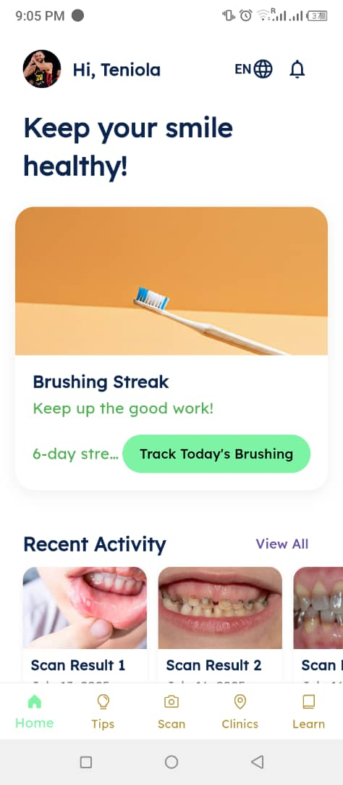
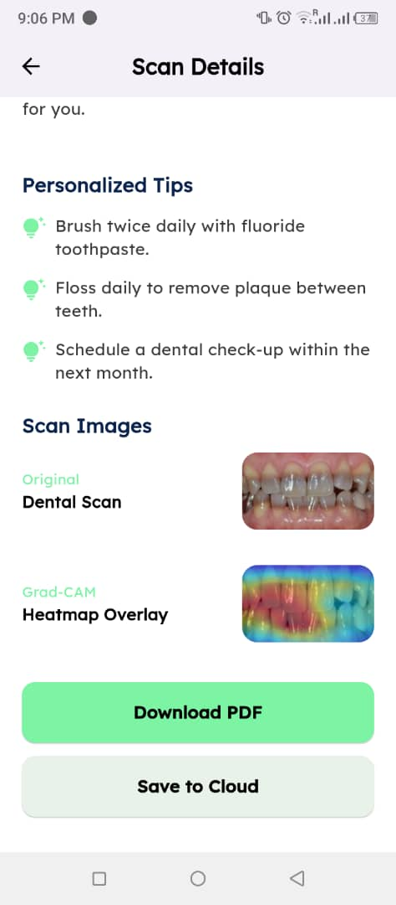
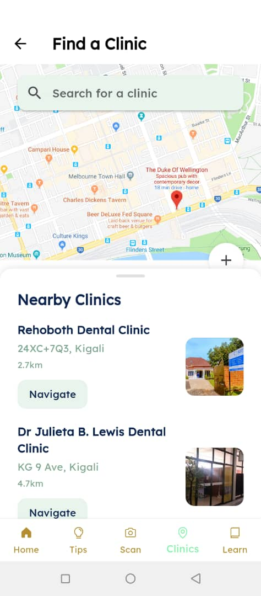
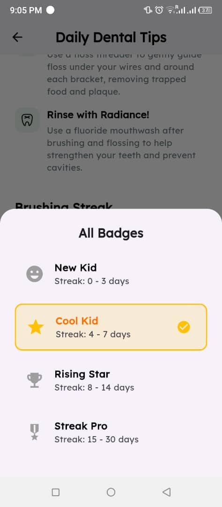
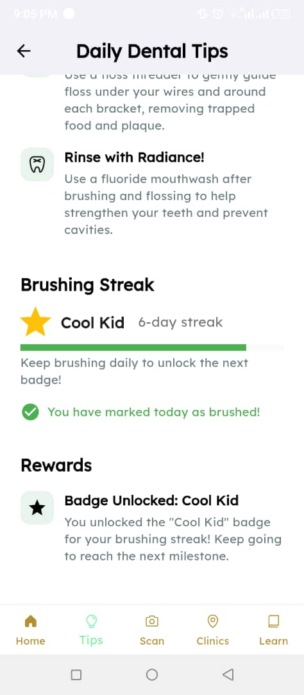

# SmileSage

## Table of Contents
- [Overview](#overview)
- [Who is this for?](#who-is-this-for)
- [Features](#features)
- [Screenshots & Demo](#screenshots--demo)
- [Getting Started](#getting-started)
- [Project Structure](#project-structure)
- [ML Model](#ml-model)
- [Testing](#testing)
- [Contributing](#contributing)

## Overview
SmileSage is a cross-platform dental health app designed to help users monitor their oral health, find nearby clinics, learn about dental care, and receive personalized reminders. The app leverages machine learning for dental scan analysis and offers a user-friendly experience on Android mobile platforms.

SmileSage empowers users to:
- Scan their teeth and receive instant analysis using a server deployed ML model
- Track and manage streaks for daily brushing, with badges awarded for consistency
- Generate and download personalized PDF reports of their scan results
- Find and view details of nearby dental clinics on a map
- Access educational content and dental care tips
- Set reminders for brushing, flossing, and dental visits
- Manage their profile and preferences
- Use the app in multiple languages

## Who is this for?
SmileSage is designed for anyone interested in monitoring their dental health using their smartphone. It’s especially useful for:
- Individuals wanting quick, AI-powered dental checks
- Dental professionals seeking a demo of mobile ML for patient engagement
- Developers interested in Flutter, on-device ML, and healthcare apps

## Features
- Dental scan & analysis using a server-deployed ML model
- Daily brushing streak tracking
- Badge awarding system for brushing milestones
- PDF report generation for scan results and progress: Generates detailed scan reports with images, analysis, and tips. See [docs/pdf_feature_documentation.md](docs/pdf_feature_documentation.md)
- Clinic finder (Google Places API): Uses Google Places API to find nearby dental clinics. See [docs/clinic_finder.md](docs/clinic_finder.md) and for setup, see [smilesage/LOCATION_FEATURE_SETUP.md](smilesage/LOCATION_FEATURE_SETUP.md)
- Chatbot for dental advice
- User authentication (Firebase)
- Educational content and tips
- Reminders & notifications
- Profile management
- Multi-language support (English, French, Swahili, Kinyarwanda)
- Android mobile support

## Analysis and Review

A detailed analysis of SmileSage's results, achievements, challenges, and lessons learned is available in the [Analysis and Review document](docs/analysis_and_review.md).

**Summary:**
- SmileSage met its main objectives: dental scan, brushing streaks, badge rewards, PDF reports, and clinic finder.
- The app was well received in user testing, with robust performance and positive feedback on its motivational features.
- Challenges included device constraints (leading to server-based ML), minor UI issues on older devices, and a focus on Android for this release.
- Lessons learned include the importance of user feedback, robust API integration, and careful management of multi-language support.

## Screenshots & Demo
Screenshots demonstrating each feature are located in the [`screenshots/`](screenshots/) folder.

- 
- 
- 
- 
- 

- Video demo: [Watch the 5-minute demo video here](https://drive.google.com/file/d/1ZTGYR0KkW2u8SYHhCMDhg-otdvJAq9-K/view?usp=sharing)

## 📁 Related Files
- **App Icons & Images:** `assets/images/`
- **Localization Files:** `lib/l10n/`
- **Documentation:** `docs/`, `deployment/`, `notebook/`

---

## 📦 Deployment / Installable Package
- **APK Link:** https://drive.google.com/file/d/1N9jhGof1yY5mbuBSPIZvfP8wuh7QNzPs/view?usp=sharing
- To build your own installable package:
  - **Android APK:** `flutter build apk`


## Getting Started

### Prerequisites
- Flutter SDK
- Python 3.x (for ML model training, optional)
- Firebase account (for auth)

### Setup

#### 1. Clone the repository
```sh
git clone https://github.com/Elhameed/SmileSage.git
cd SmileSage
```

#### 2. Flutter App
```sh
cd smilesage
flutter pub get
flutter run
```

#### 3. ML Model (Optional)
See [notebook/README.md](notebook/README.md) for model training and export instructions.

#### 4. API Keys & Configuration
- Set your Google Places API key in `smilesage/lib/services/clinic_service.dart`.
- For Google Maps, update the API key in `smilesage/android/app/src/main/AndroidManifest.xml` and `smilesage/ios/Runner/AppDelegate.swift` as described in [smilesage/LOCATION_FEATURE_SETUP.md](smilesage/LOCATION_FEATURE_SETUP.md).

## Project Structure
```
SmileSage/
├── smilesage/                # Main Flutter app (Dart code, assets, platforms)
│   ├── lib/                  # Dart source code
│   │   ├── models/           # Data models
│   │   ├── services/         # Business logic, APIs
│   │   ├── screens/          # UI screens
│   │   ├── widgets/          # Reusable widgets
│   │   └── main.dart         # App entry point
│   ├── assets/               # Images, TFLite models
│   ├── test/                 # Dart tests
│   ├── android/ ios/ ...     # Platform code
│   └── pubspec.yaml          # Flutter dependencies
├── docs/                     # Documentation
├── notebook/                 # ML/modeling
├── deployment/               # Deployment plans
├── README.md                 # Main project readme
└── CONTRIBUTING.md
```

## ML Model
- Training: See [notebook/SmileSage_dental_scanner_implementation.ipynb](notebook/SmileSage_dental_scanner_implementation.ipynb)

## 📝 Contact / Support
For questions or support, please contact: [a.ajani@alustudent.com]

---

## 💡 Acknowledgements
- Flutter & Dart teams
- My Supervisor (Mr. Marvin Ogore)
- Family and Friends that made this project a success

---
